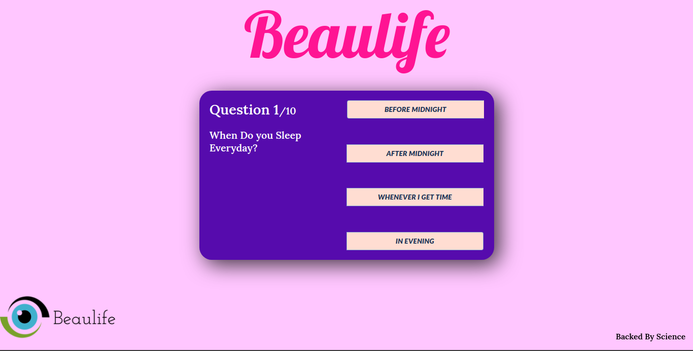

[Preview Live here](https://beaulife.vercel.app/)

Made using [React](https://reactjs.org/) , [Vite](https://vitejs.dev/) & [Replit](https://replit.com)
Github's developer pack, providing access to "replit" provided a way towards efficient and fast coding!

### WHAT THIS IS?
This is made to help people know what's wrong in their life and what they can do to improve their wellbeing/mental-health. It is a web-app with questions and on answering gives you back the feedback!

### UI/UX

The UI/UX is made using Material UI, react js, html,css, and scss.

### Todo , after completting the projects
- [x] Make the Website
- [ ] Make an AI model
- [ ] Make API
- [ ] Integrate the API
- [ ] Add more UI/UX
- [ ] Add daily questions
